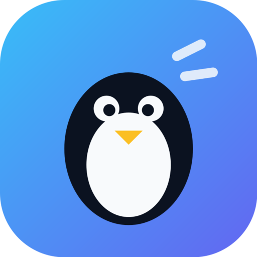

<p align="center"></p>

<h1 align="center">Penguin Stream</h1>

<p align="center"><b>Low-latency remote desktop for Windows and Fedora — no port forwarding, works behind CGNAT.</b><br>
Install, click <i>Share this screen</i>, send the invitation. That's the whole setup.</p>

---

## Download (v1.1.0)

| System | File | How |
|---|---|---|
| **Windows 10/11 x64** | `PenguinStream-1.1.0-Setup.exe` | Installer (per-user, no admin needed) |
| | `PenguinStream-1.1.0-Portable.exe` | Runs without installing |
| **Fedora 44 x86_64** | `penguin-stream-1.1.0-1.fc44.x86_64.rpm` | `sudo dnf install ./penguin-stream-1.1.0-1.fc44.x86_64.rpm` |

Get them from the [Releases page](https://github.com/Nicholasvoador/penguin-stream/releases/latest). `SHA256SUMS.txt` lists the checksums.

> **Windows SmartScreen:** the builds are not code-signed yet, so Windows may say "unrecognized app". Choose *More info → Run anyway*.
>
> **Fedora codecs:** the RPM works with Fedora's stock FFmpeg libraries, NVENC included. AMD/Intel GPU encoding
> (VA-API H.264) needs RPM Fusion's Mesa drivers — see [docs/FEDORA.md](docs/FEDORA.md).

## Using it

1. **Host** (the computer being shared): open Penguin Stream → **Share this screen**. On Wayland, pick the screen in the
   system dialog (and allow *remote control* if you want the other person to use your keyboard/mouse).
2. Send the **invitation** privately (chat/DM).
3. **Viewer:** open Penguin Stream → **Connect to a screen** → paste → **Connect**.
4. Both sides see **four verification words**. The host clicks **Allow** only if they match.

The stream opens in its own window. During a session either side can switch control on or off instantly:

| | Keyboard & mouse | Controllers | Game mode (mouse lock) |
|---|---|---|---|
| **Host** (Live session page) | allow / revoke | allow / revoke | — |
| **Viewer** (Live session page) | send / stop | send / stop | on / off |
| **Viewer** (stream window) | <kbd>Ctrl</kbd>+<kbd>Alt</kbd>+<kbd>Shift</kbd>+<kbd>M</kbd> | …+<kbd>G</kbd> | …+<kbd>Z</kbd> |

<kbd>Ctrl</kbd>+<kbd>Alt</kbd>+<kbd>Shift</kbd>+<kbd>X</kbd> toggles fullscreen, …+<kbd>Q</kbd> disconnects. Controllers appear on a Linux
host through uinput and on a Windows host as virtual Xbox 360 pads (needs the free [ViGEmBus](https://github.com/nefarius/ViGEmBus/releases) driver).

## Audio, and keeping Discord out of it

The host's desktop audio streams to the viewer on both Windows and Fedora. If you're in the same **Discord call** while
sharing, you don't want your friend hearing everyone twice (themselves included). So by default Penguin Stream **leaves
voice-chat apps out of the streamed audio**: Discord, TeamSpeak, Zoom, Teams, Mumble and others. You still hear the call
normally. You can also leave out other apps, or stream only one app (just the game). See [docs/AUDIO.md](docs/AUDIO.md).

## Connectivity: CGNAT, relays, and why friends configure nothing

- **Pairing** travels end-to-end encrypted over public Nostr relays, so there's no server to run and no port to open.
- **Media** goes **directly peer-to-peer over UDP** (ICE hole punching). That works behind most CGNATs, which use
  endpoint-independent mapping. The app's **Network** page measures your NAT type and tells you what to expect.
- If both sides are behind *strict (symmetric)* NATs, traffic falls back to a **TURN relay**. **Only one side needs a relay
  configured.** ICE pairs the other side's normal address with your relayed one, so you set it up once and the people you invite
  install and configure nothing. Options in **Settings → Relay**:
  - **Cloudflare (free, 1,000 GB/month):** anycast, so it relays through the city nearest you. Paste a TURN key ID + API token;
    only 24-hour credentials are ever used on the wire.
  - **Credentials URL:** any HTTPS endpoint returning ICE servers (e.g. Metered).
  - **Your own TURN server:** coturn on a cheap VPS; see [docs/RELAY.md](docs/RELAY.md).
  
  **Save & test relay** performs a real TURN allocation, so "configured" means "proven working".

## Latency design

Every stage is chosen for latency first:

- **Capture:** DXGI Desktop Duplication (Windows) or the PipeWire screencast portal (Wayland), plus X11.
- **Encode:** hardware H.264 (NVENC `p1`+`ull`, AMF ultra-low-latency, Quick Sync `low_delay_brc`, VA-API depth 1),
  no B-frames, zero lookahead, **single-frame VBV** so no frame takes longer than one frame interval to send. On NVIDIA the GPU does
  the BGRA→YUV conversion (about 3 ms/frame less CPU work at 1440p).
- **Transport:** an unordered, zero-retransmit DTLS/SCTP data channel. A late frame is dropped rather than delayed, and the host skips
  non-keyframes when the send queue backs up. Loss triggers an immediate keyframe request (< 100 ms recovery).
- **Display:** decoded with slice threads (no frame-threading delay) in a native SDL window, not a browser. By default each frame is
  presented the moment it's decoded (no V-Sync wait).
- **Input** runs on its own path, and relative mouse motion is coalesced per frame.

## Security

End-to-end encryption uses a Noise XX handshake over DTLS, with 160-bit invitations, four-word verification, and explicit host approval
for every new device. Relay operators and Nostr relays see only ciphertext. The local control UI is loopback-only and token-protected.
Read [SECURITY.md](SECURITY.md) for the threat model and what has *not* been independently audited.

## Building from source

Needs Node.js ≥ 20, CMake ≥ 3.20, a C++17 compiler, FFmpeg/SDL2/PipeWire/GLib development packages.

```sh
npm ci
cmake -S media -B media/build && cmake --build media/build -j
npm run app                 # run the desktop app from source
npm test                    # 110 tests (incl. a real audio session on PipeWire)
npm run dist:linux          # -> dist/penguin-stream-<v>-1.fc44.x86_64.rpm (needs rpmbuild)
npm run dist:win            # -> dist/PenguinStream-<v>-Setup.exe + Portable.exe (needs podman)
```

The Windows build cross-compiles the media engine with MinGW in a Fedora container and packages it in
electron-builder's Wine container, so nothing gets installed on the build machine. The CLI (`node node/src/cli.mjs host|connect|doctor`)
is still available for headless use and scripting.

See [LIMITATIONS.md](LIMITATIONS.md) for exactly what has and hasn't been verified, and [CHANGELOG.md](CHANGELOG.md) for what changed.

MIT licensed. Third-party components: [THIRD-PARTY.md](THIRD-PARTY.md).
